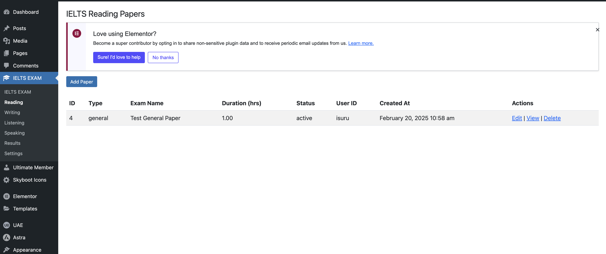
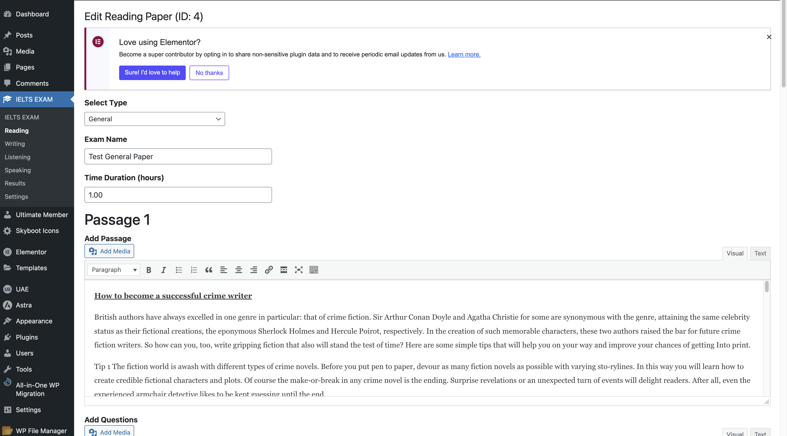
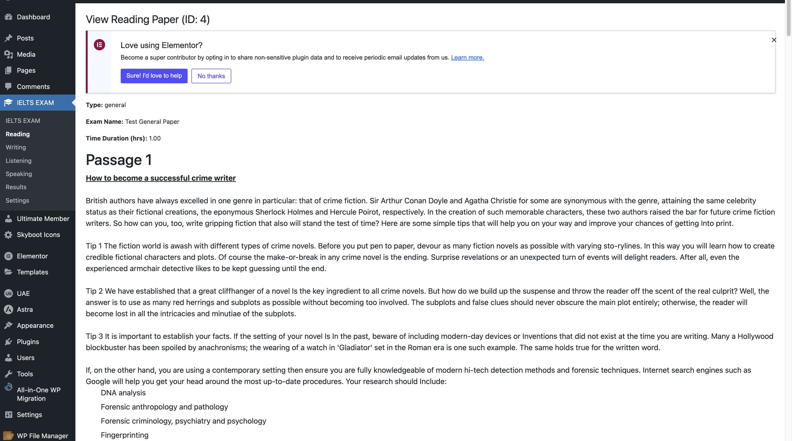
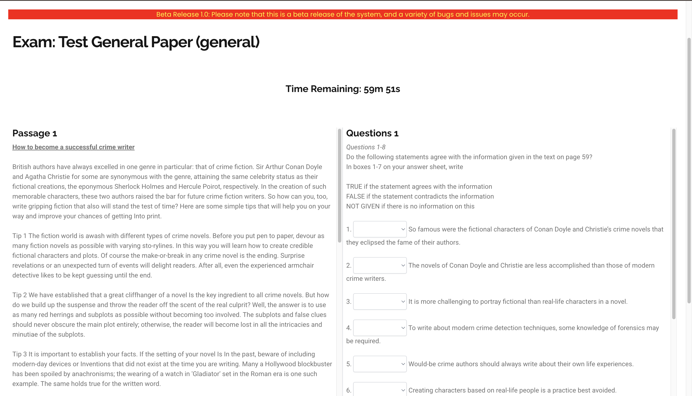
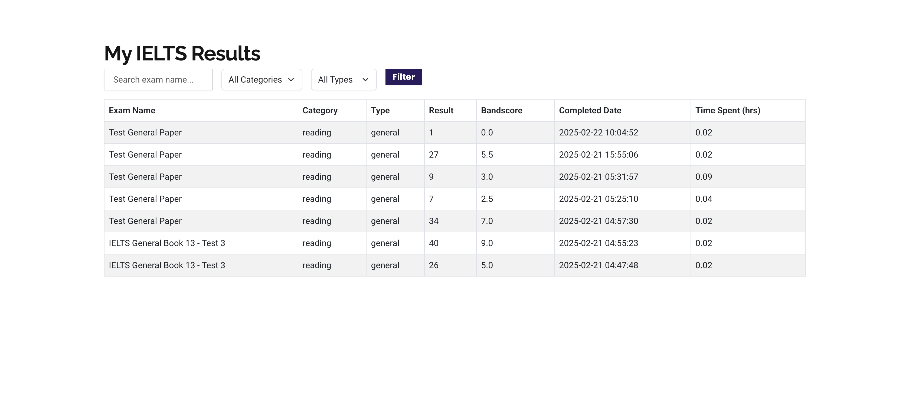

# WP IELTS EXAM PLUGIN

## Description

This plugin simulate the IELTS exam 4 categories, READING, WRITING, LITENING and SPEKING.

## Shortcodes with Pages

| Index | page                   | Shortcode                       |
| ----- | ---------------------- | ------------------------------- |
| 1     | ielts-listening        | [ielts_listening_exam]          |
| 2     | ielts-reading          | [ielts_reading_exam]            |
| 3     | ielts-speaking         | [ielts_speaking_exam]           |
| 4     | ielts-writing          | [ielts_writing_exam]            |
| 5     | ielts-speaking-marking | [ielts_speaking_marking]        |
| 6     | ielts-speaking-marking | [ielts_speaking_marking_manual] |
| 7     | ielts-writing-marking  | [ielts_writing_marking]         |
| 8     | my-dashboard           | [ielts_my_results]              |

## ADMIN SIDE

Admins can add the IELTS paper using simple HTML and CSS and JSON.

## CLIENT SIDE

Students can do the papers that admin added to the system. Once done student can get thires marks form the dashboard section.

